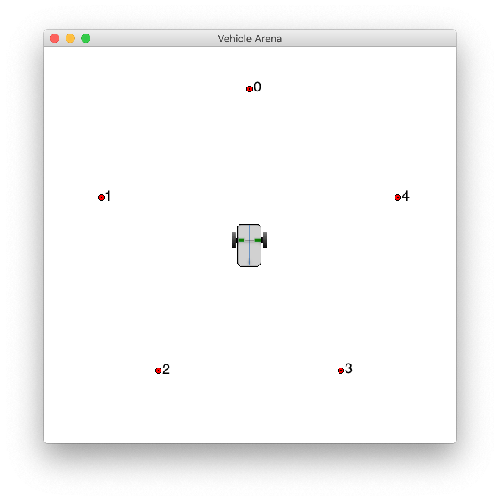
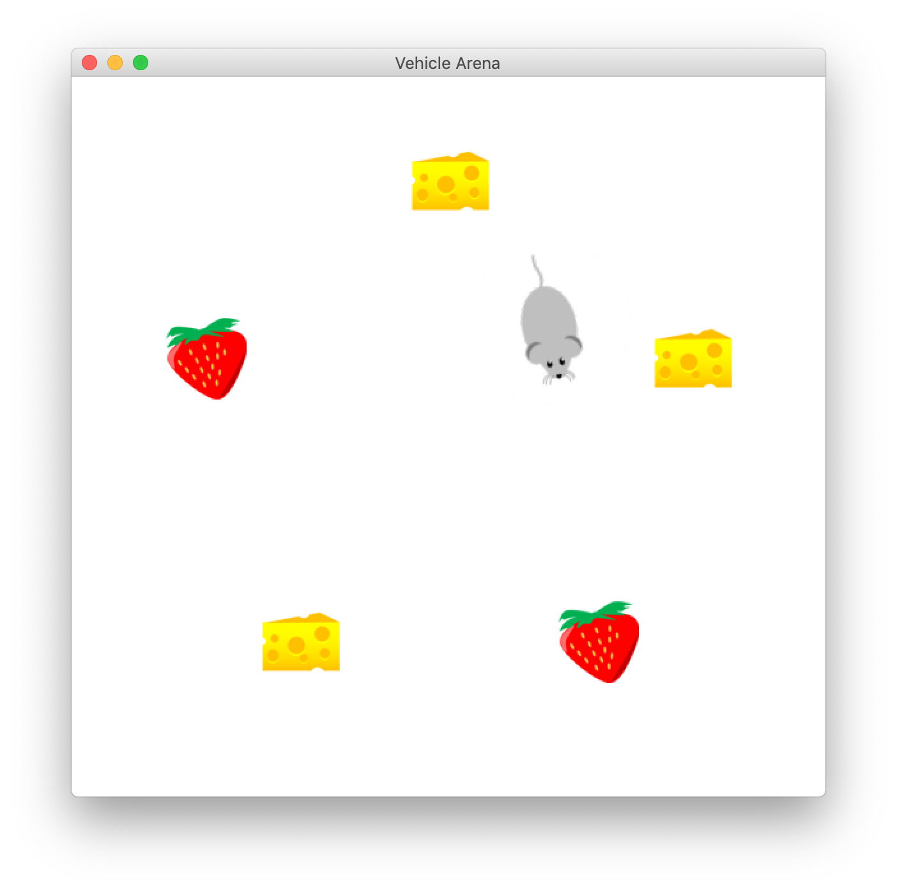

# Graphics

**Contents**

* [class Feature](#class-Feature)<br>
* [class ArenaMap](#class-ArenaMap)<br>
* [class EVDisplay](#class-EVDisplay)<br>

---

<a id=class-Feature></a>
## class Feature

### Description

The Feature class represents a graphical feature in an [ArenaMap](#class-ArenaMap). It consists of a 2D position, an orientation, and an image. The position is specified by North, and West.

| Access | Member Name   | Type         | Units  | Value  |
|--------|---------------|--------------|--------|--------|
| public | north         |double        |   --   |        |
| public | west          |double        |   --   |        |
| public | heading       |double        |   --   |        |
| public | bufImage      |BufferedImage |   --   |        |

### Constructor

```
public Feature(double N, double W, double H, String imageFile)
```
Create a Feature with position (**N,W**), heading (**H**), and image stored in **imageFile**.

### Member Functions

```
public void setState(double N, double W, double H)
```

Set the position (**N,W**), heading (**H**) of the Feature.

---

<a id=class-ArenaMap></a>
## class ArenaMap 
extends [JPanel](https://docs.oracle.com/javase/7/docs/api/javax/swing/JPanel.html)

### Description
The ArenaMap class creates, and manages a graphical display of [Features](#class-Feature) in an arena.

| Access | Member Name     | Type           | Units  | Value  |
|--------|-----------------|----------------|--------|--------|
| private | featureList    | List\<Feature\>|   --   | Constructor Arg|
| private | metersPerPixel | double         |   --   | Constructor Arg|
| private | groundColor    | Color          |   --   | White  |

### Constructor

```
public ArenaMap(List<Feature> flist, double mapScale)
```
Initialize an ArenaMap object to the given mapscale, and containing the given list of graphical features.

### Member Functions

```
public void SetScale (double mapScale);
```
Set the screen resolution of the Arenamap (meters/pixel).

```
private void doDrawing(Graphics g);
```

---

## class EVDisplay 
extends [JFrame](https://docs.oracle.com/javase/7/docs/api/javax/swing/JFrame.html)

### Description
This class implements a Trick variable server client application for SIM_wheelbot that displays the vehicle and its waypoints. The position of the vehicle is updated over time.  

#### Running the Client
```
java -jar EVDisplay.jar -v <vehicle-image-file> -w <waypoints-file> <port>
```

* **-v** : specify the image to be used for the vehicle.
* **-w** : specify the waypoint positions, headings, and images, in the format shown below.
* **\<port\>** : the port number for the Trick variable server.

#### Example :

```
java -jar EVDisplay.jar -v "images/twoWheelRover.png" -w "Modified_data/pentagon.waypoints" <port>
```

##### ```Modified_data/pentagon.waypoints``` :

```
1.0000,0.0,0.0,images/wp0.png
0.3093,0.9511,0.0,images/wp1.png
-0.8090,0.5878,0.0,images/wp2.png
-0.8090,-0.5878,0.0,images/wp3.png
0.3090,-0.9511,0.0,images/wp4.png
```



#### A More Fun Example: 

```
java -jar EVDisplay.jar -v "images/mouse_128x128.png" -w "Modified_data/pentagon.snackpoints" <port>
```

##### ```Modified_data/pentagon.snackpoints``` :

```
1.0000,0.0,0.0,images/cheese_64x64.png
0.3093,0.9511,0.0,images/strawberry_64x64.png
-0.8090,0.5878,0.0,images/cheese_64x64.png
-0.8090,-0.5878,0.0,images/strawberry_64x64.png
0.3090,-0.9511,0.0,images/cheese_64x64.png
```


### Constructor
```
public EVDisplay(ArenaMap arena)
```

### Member Functions

```
public void connectToServer(String host, int port ) throws IOException
```
Connect to the Trick variable server as specified by **host** and **port**.

```
public void drawArenaMap()
```
Calls the [ArenaMap](#class-ArenaMap)'s repaint() method, that is inherited from the Java-Swing JPanel class. This causes the ArenaMap's doDrawing() method to be called, which draws the arena.

```
public static void main(String[] args) throws IOException
```

* Process Args
* Validate Parameters
* Read and process the waypoint file:
   * For each waypoint, create a  [Feature](#class-Feature) and add it to the feature-list.
* Create a Feature for the vehicle, and add it to the feature-list.
* Connect to the Trick variable server on the local computer ("localhost") at the port number specified by the applicaton arguments.
* Request the vehicle position and heading at 10Hz.
* Enter a continuous while loop that reads, and correspondingly sets the vehicle state.


