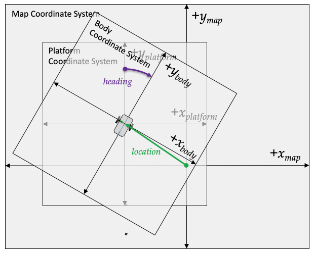
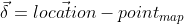
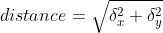
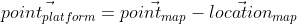
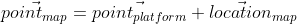
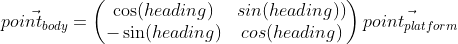

# Guidance

**Contents**

* [class Point](#class-Point)<br>
* [class Arena](#class-Arena)<br>
* [class Navigator](#class-Navigator)<br>
* [class GridSquare](#class-GridSquare)<br>
* [function FindPath](#function-FindPath)<br>

---

<a id=class-Point></a>
## class Point
This class simply represents a 2D point.

### Description
| Access  | Member Name      | Type   | Units  | Value  |
|---------|------------------|--------|--------|--------|
| public  | x                | double | --     |        |
| public  | y                | double | --     |        |

### Constructors
```
    Point(): x(0.0),y(0.0) {}
```
```
    Point(double X, double Y): x(X),y(Y) {}
```
### Member Functions


---


<a id=class-Navigator></a>
## class Navigator

### Description

The Navigator class represents simple navigation state. It is simply a position, and heading on a map. A position on the map is represented by a [Point](#class-Point).

| Access  | Member Name      | Type                | Units  | Value  |
|---------|------------------|---------------------|--------|--------|
| public  | heading          |double               |   --   |        |
| public  | location         |[Point](#class-Point)|   --   |        |


#### Coordinate Systems



* The **map** coordinate system is simply a 2 dimensional cartesion system on which we can place vehicles, waypoints, and so forth.
* A vehicle's **platform** coordinate system is the same as the map coordinate system except that its origin is fixed to the center of the vehicle.
* A vehicle's **body** coordinate system is fixed to the vehicle's location and its heading. It is the same as the vehicle's platform coordinate system except that it's rotated about the vehicle center by its heading angle.

### Constructor

```
        Navigator(double initial_heading, Point initial_location);
        
```

### Member Functions
```
        void setHeading(double heading);
```

```
        void setLocation(double north, double west);
```

```
        double distanceTo(Point& mapPoint);
```

<!--
\vec{\delta} = \vec{location} - point_{map}
{distance} = \sqrt{ \delta_{x}^{2}  + \delta_{y}^{2}}
-->



   
```        
        double bearingTo(Point& mapPoint);
```
<!--
point_{platform}=\texttt{convertMapToPlatform}(point_{map})
point_{body}=\texttt{convertPlatformToBody}(point_{platform})
bearing=\frac{\arcsin(point_{body_x})}{\texttt{distanceTo}(point_{map})}
-->

```
        Point convertMapToPlatform(Point& mapPoint);
```
<a id=Eq1-map-to-platform></a>
<!--
\vec{point_{platform}} = \vec{point_{map}} -  \vec{location}_{map}
-->


```
        Point convertPlatformToMap(Point& platformPoint);
```
<a id=Eq2-platform-to-map></a>
<!--
\vec{point_{map}} = \vec{point_{platform}} +  \vec{location}_{map}
-->


```
        Point convertPlatformToBody(Point& platformPoint);
```

<a id=Eq3-platform-to-body></a>
<!--
\vec{point_{body}} =
\begin{pmatrix} \cos (heading)&sin(heading)) \\ -\sin(heading)&cos(heading) \end{pmatrix}
\vec{point_{platform}}
-->


```
        Point convertBodyToPlatform(Point& bodyPoint);
```

<a id=Eq4-body-to-platform></a>
<!--
\vec{point_{platform}} = 
\begin{pmatrix} \cos (heading)&-\sin(heading)) \\ sin(heading)&cos(heading) \end{pmatrix}
\vec{point_{body}}
-->


---


<a id=class-GridSquare></a>
## class GridSquare

### Description
A GridSquare is a component of an [Arena](#class-Arena). It represents the attributes of a specific location within the Arena.

| Access  | Member Name      | Type        | Units  | Value  |
|---------|------------------|-------------|--------|--------|
| public  | isBlocked        | bool        | --     |        |
| public  | mark             | char        | --     |        |
| public  | parent           | GridSquare* | --     |        |
| public  | g_score          | int         | --     |        |
| public  | f_score          | int         | --     |        |

* **isBlocked** means that the grid square cannot be entered, as if because of an obstacle, or a wall.
* **mark** is simply a single printable character that indicates the status of a gridsquare when printing out the arena.

The remaining three attributes represent a path across the Arena as determined by the [A* Path Finding Algorithm](https://en.wikipedia.org/wiki/A*_search_algorithm).

* **parent** is a pointer to the previous Gridsquare, in the path from an origin Gridsquare to the current Gridsquare. When the A* search arrives at the destination, the path solution is the list of Gridsquares linked by the parent pointers. 
* **g_score** is the "cost" to travel from the origin to the current Gridsquare.
* **f_score** is the sum of the g_score and the estimated cost to the path destination (h).

### Constructor
### Member Functions


---

<a id=class-Arena></a>
## class Arena

An Arena is an 2D array of [GridSquares](#class-GridSquare). It represents a physical environment, with obstacles, in which a vehicle can navigate. 

### Description
| Access  | Member Name | Type        | Units  | Value  |
|---------|-------------|-------------|--------|--------|
| public  | height      | int         |   --   |        |
| public  | width       | int         |   --   |        |
| public  | grid        | GridSquare* |   --   |        |


### Constructor

```
        Arena(unsigned int width, unsigned int height);
```

```
        Arena(unsigned int width, unsigned int height, unsigned char bits[]);
```

```
        ~Arena();
```
### Member Functions


```
        int getHeight(){return height;}
```
Return the height (number of Gridsquare rows) in the Arena.

```
        int getWidth(){return width;}
```
Return the width (number of Gridsquare columns) in the Arena.

```
        void block(unsigned int x, unsigned int y);
```
Block the Gridsquare at (x,y) , so that it can't be traversed.

```
        void unblock(unsigned int x, unsigned int y);
```
Un-block the Gridsquare at (x,y), so that it can be traversed.

```
        void mark(unsigned int x, unsigned int y, char c);
```

```
        std::vector<GridSquare*> getNeighbors(GridSquare* gridSquarePointer);
```
Return a list of non-blocked, immediate neighbors, of the given Gridsquare. The returned list may contain up to eight neighbors.

```
        GridSquare* getGridSquare(unsigned int x, unsigned int y);
```
Return a pointer to the Gridsquare object at (x,y).

```
        int getGridSquareCoordinates(GridSquare* gridSquarePointer, Point& coords);
```
Given a pointer to a Gridsquare object within the Arena, return its (x,y) coordinates.

```
        int movementCostEstimate(GridSquare* orig, GridSquare* dest, int& cost);
```
Calculate a **cost** estimate of the to travel from **orig** to **dest**. Return 0 on success, 1 on failure.

```
        int distanceBetween(GridSquare* orig, GridSquare* dest, int& distance);
```
Calculate the straight-line distance from **orig** to **dest**.

---


<a id= function-FindPath></a>
## function FindPath

```
std::vector<Point> FindPath( GridSquare* origin, GridSquare* goal, Arena* arena)
```

### Description
Using the [A* Path Finding Algorithm](https://en.wikipedia.org/wiki/A*_search_algorithm), return a path (as a vector of [Points](#class-Point)) from **origin** to **goal**, in the given [Arena](#class-Arena).


### Constructor
### Member Functions