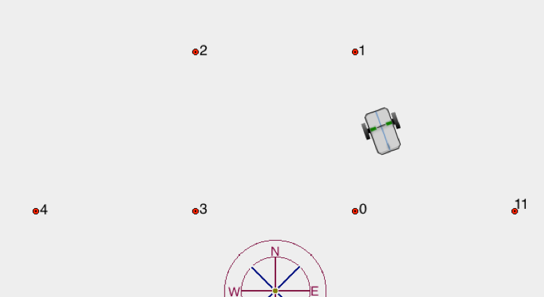
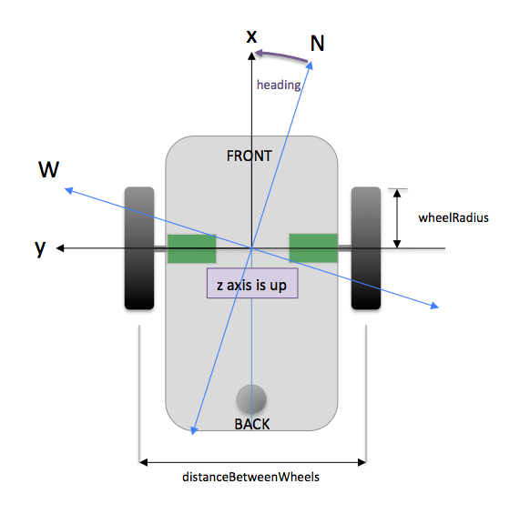

# SIM\_wheelbot

---

SIM\_wheelbot is a simulation of a two-wheeled electric vehicle that follows a set of waypoints.


---
### Building the Simulation
In the SIM\_wheelbot directory, type **trick-CP** to build the simulation executable. When it's complete, you should see:

```
=== Trick build process complete ===
```

Now **cd** into models/Wheelbot/Graphics/ and type **make**. This builds the display client for the simulation. Then **cd** into models/Wheelbot/guicontrol1 and type **make**. This builds the gui control that allows user to command the wheelbot to go to home point.

### Running the Simulation (without HLA)
In the SIM_wheelbot directory:

```
% S_main_*.exe RUN_test/input.py -HLA-off
```
### Running the Simulation (with HLA)

In order to run a federation, the user must have PitchRTI installed, as well as the latest version  of the NASA/TrickHLA repository from GitHub.com.
Once you have the required software installed, you can test the simulation. 
In the S_define file:
Uncomment the line which says #define HLA.
In the SIM_wheelbot directory, first type **make spotless** and then **trick-CP** again. Then:

```
% S_main_*.exe RUN_test/input.py
```


After running a single wheelbot using HLA (RUN_test), we can now move on to building a federation.

### Running the Wheelbot-Test Federation
The SIM_Roles_Test RUN_mpr serves as the Master, Pacing, and Root Reference Frame Publisher (MPR) for the federation. Wheelbot-1 (RUN_wb1) publishes its location to the RTI as it navigates to its waypoints. Wheelbot-2 (RUN_wb2) creates its waypoints by subscribing to this location data, and follows Wheelbot-1 around. The graphics need to be rebuilt with the following lines uncommented:
Feature vehicle2 = new Feature(0, 0, Math.toRadians(0), vehicleImageFile);
featureList.add(vehicle2); 

vehicle2.setState(N2,W2,H2);

Now **cd** into models/Wheelbot/Graphics/ and type **make**. This will draw both wheelbots in the display.

When running SIM_Roles_Test RUN_mpr, the user must specify the name of the federation and the name of the known, required federate in order for the federation to form properly.

In the SIM_Roles_Test directory:

```
% S_main_*.exe RUN_mpr/input.py --federation Wheelbot_Test --knownfederate Wheelbot-1
```

In the SIM_wheelbot directory:

```
% S_main_*.exe RUN_wb1/input.py
```
```
% S_main_*.exe RUN_wb2/input.py
```

### If running with student version of pRTI
The student version of PitchRTI only allows two federates to be run at once. RUN_OnlyWB was created to serve the purpose of RUN_mpr AND RUN_wb1.

In the SIM_wheelbot directory:

```
% S_main_*.exe RUN_OnlyWB/input.py
```
```
% S_main_*.exe RUN_wb2/input.py
```

### Inputs
Variable                                       | Type           | Units | Default Value
-----------------------------------------------|----------------|-------|--------------
veh.vehicle.distance_between_wheels              | double         | m     | 0.183
veh.vehicle.wheel_radius                        | double         | m     | 0.045
veh.vehicle.wheel_speed_limit                    | double         | rad/s | 8.880
veh.vehicle.heading_rate_limit                   | double         | rad/s | 𝛑/4
veh.vehicle.wheel_drag_constant                  | double         | --    | 1.875
veh.vehicle.corning_stiffness                   | double         | --    | 10.0
veh.vehicle.slow_down_distance                   | double         | --    | 0.5
veh.vehicle.arrival_distance                    | double         | --    | 0.1



#### Adding Waypoints
Waypoints, for the vehicle to follow, are added with a call to

veh.vehicle.add_waypoint( double N, double W )

#### Adding Home point
A home point is designated by the last waypoint in the waypoint file.


### Input/Output
Variable                                       | Type           | Units
-----------------------------------------------|----------------|-------
veh.vehicle.position                           | double[2]      | m
veh.vehicle.velocity                           | double[2]      | m
veh.vehicle.heading                            | double         | rad
veh.vehicle.heading_rate                        | double         | rad


### Outputs
Variable                                      | Type           | Units
----------------------------------------------|----------------|--------
veh.vehicle.acceleration                      | double[2]      | m
veh.vehicle.heading_accel                      | double         | rad
veh.vehicle.drive_force                        | double[2]      | N
veh.vehicle.lateral_tire_force                  | double[2]      | N
veh.vehicle.rolling_resist_force                | double[2]      | N
veh.vehicle.force_total                        | double[2]      | N
veh.vehicle.vehicle_Z_torque                    | double         | N*m
